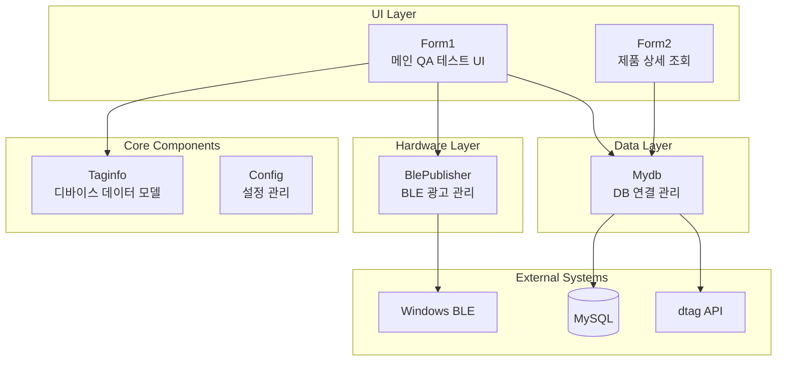

# Carrot QA Production - 프로젝트 문서

## 개요

**Carrot QA**는 Carrot Plug 제조 및 생산 품질 검증을 위한 QA 테스트 프로그램입니다. 세 가지 단말기 타입(LUX1/R4, LUX2/BG770, EMT)에 대한 QA 테스트를 자동화합니다.

| 항목 | 내용 |
|------|------|
| 플랫폼 | Windows Forms (.NET Framework 4.7.2) |
| 버전 | 2.0.0 |
| 저장소 | `c:\Project\GitHub\carrot_production` |

---

## 프로젝트 구조

```
carrot_production/
├── Carrot_QA_test/                    # 메인 애플리케이션 프로젝트
│   ├── BlePublisher.cs                # Bluetooth LE 광고 기능
│   ├── Config.cs                      # INI 파일 관리 및 설정
│   ├── CRC16.cs                       # CRC16 체크섬 유틸리티
│   ├── Form1.cs                       # 메인 QA 테스트 UI 폼
│   ├── Form2.cs                       # 제품 상세 조회 폼
│   ├── Program.cs                     # 애플리케이션 진입점
│   ├── Taginfo.cs                     # Carrot Plug 데이터 모델
│   ├── VersionManager.cs              # 버전 추적
│   └── config.ini                     # 런타임 설정 파일
│
├── CarrotQA_BG770_Setup/              # BG770 버전 인스톨러
├── CarrotQA_EMT_Setup/                # EMT 버전 인스톨러
├── CarrotQA_R4_Setup/                 # R4/SARA-R4 버전 인스톨러
│
├── Carrot_QA_test.sln                 # Visual Studio 솔루션 파일
├── README.md                          # 프로젝트 개요
└── CHANGELOG.md                       # 버전 히스토리
```

---

## 주요 기능

### 1. Bluetooth LE 디바이스 감지
- BLE 광고를 통한 Carrot Plug 디바이스 스캔 및 모니터링
- Windows Runtime BLE API 사용

### 2. 다단계 QA 테스트
| 단계 | 내용 |
|------|------|
| **QA1** | 초기 플러그 검증 |
| **QA2** | 신호 강도 및 센서 검증 (GPS SNR, 온도, 정전용량, LTE 대역) |
| **QA3** | 버전 확인 및 최종 검증 |

### 3. 데이터베이스 연동
- MySQL 데이터베이스에 실시간 테스트 결과 저장
- 서버: `115.68.195.106:3306` (LuckyBox Solution)
- 데이터베이스: `carrotpluglist`

### 4. 디바이스 등록
- 외부 API를 통한 서버 측 디바이스 등록
- Main: `https://dtag.carrotins.com:8080/api/v1/dtag/registries`
- Test: `https://t-dtag.carrotins.com:8080/api/v1/dtag/registries`

### 5. 데이터 분석
- 합격/불합격 통계 추적 및 모니터링
- 제품 이력 및 QA 상태 조회

---

## 핵심 컴포넌트

### Form1 (메인 UI)
**파일**: `Carrot_QA_test/Form1.cs`

| 기능 | 설명 |
|------|------|
| BLE 스캐닝 | 디바이스 검색 및 광고 감시 |
| ListView | IMEI, CCID, BLE ID, RSSI, Pass/Reg/Note 표시 |
| 검색/필터 | 디바이스 필터링 기능 |
| IP 감지 | 내부/외부 IP 주소 표시 |
| DB 상태 | 데이터베이스 연결 상태 표시 |

### Taginfo (데이터 모델)
**파일**: `Carrot_QA_test/Taginfo.cs`

**속성**:
- MAC 주소, IMEI, ICC ID, BLE ID, RSSI
- QA 상태 필드: `qa1`, `qa2`, `qa3` 및 실패 유형
- 테스트 데이터: GPS SNR, 온도, 정전용량, LTE 대역 측정값

### Mydb (데이터베이스 관리)
**파일**: `Carrot_QA_test/Taginfo.cs`

**주요 메서드**:
| 메서드 | 용도 |
|--------|------|
| `UpdateQuery(imei, icc_id)` | ICC ID 업데이트 |
| `UpdateQuery_qa2(...)` | QA2 테스트 결과 저장 |
| `UpdateQuery_qa3(...)` | QA3 테스트 결과 저장 |
| `UpdateQuery_dtag(...)` | 디바이스 등록 상태 업데이트 |
| `GetProduct(imei)` | 단일 제품 상세 조회 |
| `ReflashList()` | 제품 목록 로드 (최대 1000건) |
| `regist_server(imei)` | 외부 API 디바이스 등록 |

### BlePublisher (BLE 통신)
**파일**: `Carrot_QA_test/BlePublisher.cs`

| 항목 | 값 |
|------|---|
| Company ID | `0x4151` |
| Magic Code | `0x40` |
| Action Byte | `0x60` |
| 기능 | IMEI 인코딩, CRC16 검증, 상태 관리 |

### Config (설정 관리)
**파일**: `Carrot_QA_test/Config.cs`

- 커스텀 INI 파일 파서
- 섹션 및 키-값 쌍 지원
- 타입 변환 지원 (int, bool, double)
- 스레드 안전 싱글톤 패턴

---

## 데이터베이스 스키마

**테이블**: `tb_product`

| 컬럼 | 설명 |
|------|------|
| `imei` | 디바이스 IMEI (15자리) - 기본 키 |
| `icc_id` | SIM ICC ID |
| `sn` | 시리얼 번호 |
| `device_id` | Carrot Plug 디바이스 ID |
| `ble_id` | Bluetooth MAC 주소 |
| `prod_date` | 생산일 |
| `lot_no` | 제조 로트 번호 |
| `qa1`, `qa2`, `qa3` | QA 테스트 상태 (OK/NG) |
| `ng1_type`, `ng2_type`, `ng3_type` | 실패 유형 설명 |
| `dtag` | 디바이스 등록 상태 |
| `qa2_gps_snr` | GPS 신호 대 잡음비 |
| `qa2_temperature` | 디바이스 온도 |
| `qa2_cap` | 정전용량 측정값 |
| `qa2_ble_rssi` | Bluetooth 신호 강도 |
| `qa2_lte_b3_min/avg/max` | LTE Band 3 측정값 |
| `qa2_lte_b5_min/avg/max` | LTE Band 5 측정값 |

---

## 외부 의존성

### NuGet 패키지
| 패키지 | 버전 | 용도 |
|--------|------|------|
| MySql.Data | 8.0.25 | MySQL 데이터베이스 커넥터 |
| Newtonsoft.Json | 13.0.1 | JSON 직렬화/역직렬화 |
| BouncyCastle | 1.8.5 | 암호화 및 보안 |
| Google.Protobuf | 3.14.0 | Protocol Buffer 지원 |
| K4os.Compression.LZ4 | 1.1.11 | LZ4 압축 |
| K4os.Hash.xxHash | 1.0.6 | xxHash 알고리즘 |
| System.Buffers | 4.5.1 | 버퍼 유틸리티 |
| System.Memory | 4.5.3 | 메모리 관리 |

### Windows API
- `Windows.Devices.Bluetooth.*`: BLE 디바이스 열거 및 광고
- `Windows.Devices.Enumeration`: 디바이스 검색
- `Windows.Storage.Streams`: 데이터 스트림 처리

---

## 설정 파일

### config.ini
```ini
[DB]
Server=115.68.195.106
Port=3306
Database=carrotpluglist
User=luxrobo
Password=fjrtmfhqh123$

[Network]
VPNEnable=true
VPNServer=

[Application]
EnableLogging=false
```

---

## 빌드 및 배포

### 솔루션 구조
| 프로젝트 | 타입 | 설명 |
|----------|------|------|
| Carrot_QA_test | WinForms | 메인 애플리케이션 |
| CarrotQA_BG770_Setup | 인스톨러 | LUX2 (BG770 모뎀) 버전 |
| CarrotQA_EMT_Setup | 인스톨러 | EMT 디바이스 버전 |
| CarrotQA_R4_Setup | 인스톨러 | LUX1 (SARA-R4 모뎀) 버전 |

### 빌드 설정
- **타겟 프레임워크**: .NET Framework 4.7.2
- **출력 타입**: Windows Forms Application (WinExe)
- **코드 서명**: 활성화 (`Carrot_QA_test_TemporaryKey.pfx`)
- **배포 URL**: `C:\Deploy\`

---

## Git 브랜치 전략

| 브랜치 | 용도 |
|--------|------|
| `main` | 프로덕션/마스터 브랜치 |
| `BG770_QA` | LUX2 BG770 버전 (현재) |
| `EMT_QA` | EMT 버전 |
| `R4_QA` | LUX1 R4/SARA-R4 버전 |

---

## 컴포넌트 관계도

```
┌─────────────────────────────────────────────────────────────┐
│                        Form1 (UI Layer)                      │
│                   메인 QA 테스트 인터페이스                    │
├──────────────────────┬──────────────────┬───────────────────┤
│                      │                  │                   │
▼                      ▼                  ▼                   ▼
┌──────────┐    ┌──────────┐      ┌──────────┐       ┌────────┐
│BlePublisher│    │  Mydb   │      │ Taginfo  │       │ Config │
│(Hardware)  │    │ (Data)  │      │ (Model)  │       │(설정)  │
└──────────┘    └──────────┘      └──────────┘       └────────┘
     │                │                 │                  │
     ▼                ▼                 │                  ▼
┌──────────┐    ┌──────────┐           │           ┌──────────┐
│Windows BLE│    │  MySQL   │           │           │ INI File │
│   APIs    │    │ Database │◄──────────┘           │ Parser   │
└──────────┘    └──────────┘                        └──────────┘
                     │
                     ▼
              ┌──────────────┐
              │ External API │
              │(dtag.carrot) │
              └──────────────┘
```

---

## 유틸리티 클래스

### VersionManager
**파일**: `Carrot_QA_test/VersionManager.cs`
- 리플렉션 기반 버전 추적
- Version, FileVersion, ProductName, CompanyName, BuildDate 제공

### CRC16
**파일**: `Carrot_QA_test/CRC16.cs`
- CRC16 체크섬 계산 (다항식: 0x8005)
- `ComputeChecksum()`, `ComputeChecksumInComp()` 메서드 제공
- Bluetooth 광고 데이터 검증에 사용

---

## 보안 고려사항

⚠️ **주의**: 현재 코드에 하드코딩된 자격 증명이 포함되어 있습니다.

| 위치 | 내용 |
|------|------|
| Config.cs | MySQL 기본 자격 증명 |
| Taginfo.cs | API Bearer 토큰 |
| config.ini | 데이터베이스 비밀번호 |

**권장사항**:
- 환경 변수 또는 암호화된 설정 사용
- 자격 증명을 소스 코드에서 분리
- 프로덕션 배포 전 토큰 교체

---

## 최근 변경 이력

| 커밋 | 설명 |
|------|------|
| `22ba20f` | Setup 파일에 버전 추가 |
| `bfb833a` | Database 정보 추가 정리 |
| `71f0bbc` | 럭키박스 솔루션 DB 연결 |
| `196cd66` | IP확인 URL 변경 |
| `17a5020` | 브랜치 머지 |

---

## 다이어그램

프로젝트의 상세 다이어그램은 `docs/` 디렉토리에서 Mermaid 파일로 확인할 수 있습니다.

| 파일 | 설명 |
|------|------|
| [`docs/architecture.mmd`](docs/architecture.mmd) | 시스템 아키텍처 다이어그램 |
| [`docs/class-diagram.mmd`](docs/class-diagram.mmd) | 클래스 다이어그램 |
| [`docs/qa-flow.mmd`](docs/qa-flow.mmd) | QA 테스트 플로우차트 |
| [`docs/sequence-qa.mmd`](docs/sequence-qa.mmd) | QA 프로세스 시퀀스 다이어그램 |
| [`docs/database-erd.mmd`](docs/database-erd.mmd) | 데이터베이스 ERD |
| [`docs/ble-state.mmd`](docs/ble-state.mmd) | BLE 상태 머신 다이어그램 |
| [`docs/deployment.mmd`](docs/deployment.mmd) | 배포 프로세스 다이어그램 |

### 아키텍처 개요



### QA 테스트 플로우


---

## 기술 요약

| 항목 | 내용 |
|------|------|
| 아키텍처 | 다중 디바이스 지원 (3개 하드웨어 변형) |
| BLE 스캐닝 | Windows Runtime BLE API |
| 데이터베이스 | MySQL 중심 설계 |
| 테스트 파이프라인 | QA1/2/3 단계별 검증 |
| 외부 연동 | Bearer 토큰 인증 API |
| 설정 | 커스텀 INI 파서 (레지스트리 의존성 제거) |
| UI 패턴 | Windows Forms 코드비하인드 (MVVM 미사용) |
| 싱글톤 서비스 | BlePublisher, ApplicationSettings |

---

## Reg 컬럼 판단 로직 (코드 기준)

- `ListView`의 `Reg` 컬럼은 `tag.dbString` 값을 그대로 표시한다.
  - 코드: `LVI.SubItems.Add(tag.dbString)` (`Carrot_QA_test/Form1.cs`)
- `dbString` 값은 아래 분기로 결정된다.
  - DB 연결 + 업데이트 성공(`result == 1`): `OK`
  - DB 연결 + 업데이트 실패(`result != 1`): `Fail`
  - Standalone/DB 미사용: `Local`
  - Simulation 모드: `SIM`
- 현재 `Reg` 컬럼은 `regist_server()`의 외부 등록 API 호출 결과를 직접 표시하지 않는다.
  - `regist_server()`는 구현되어 있으나 `Form1.cs`에서는 호출되지 않음.
