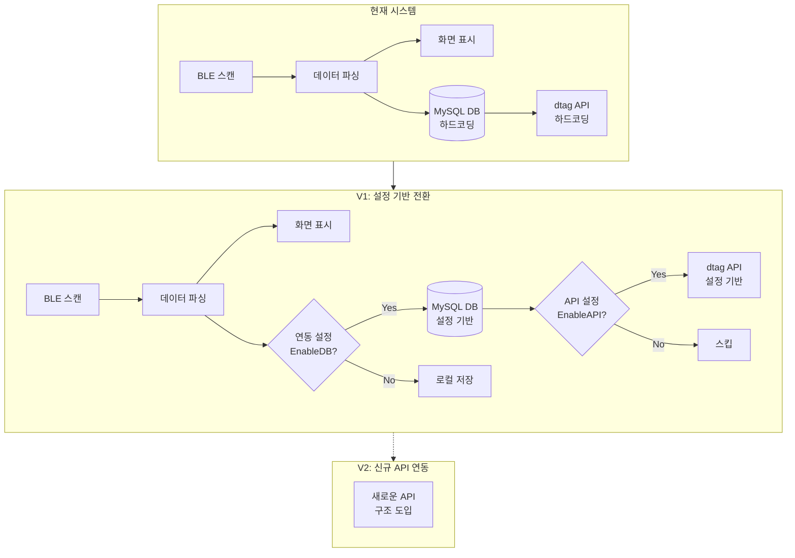
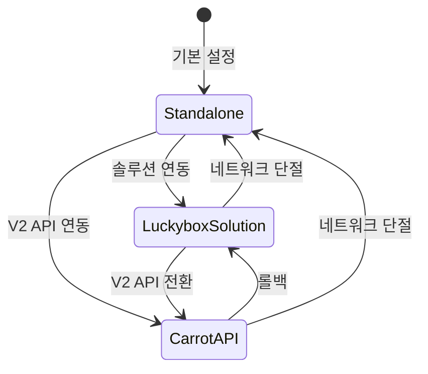
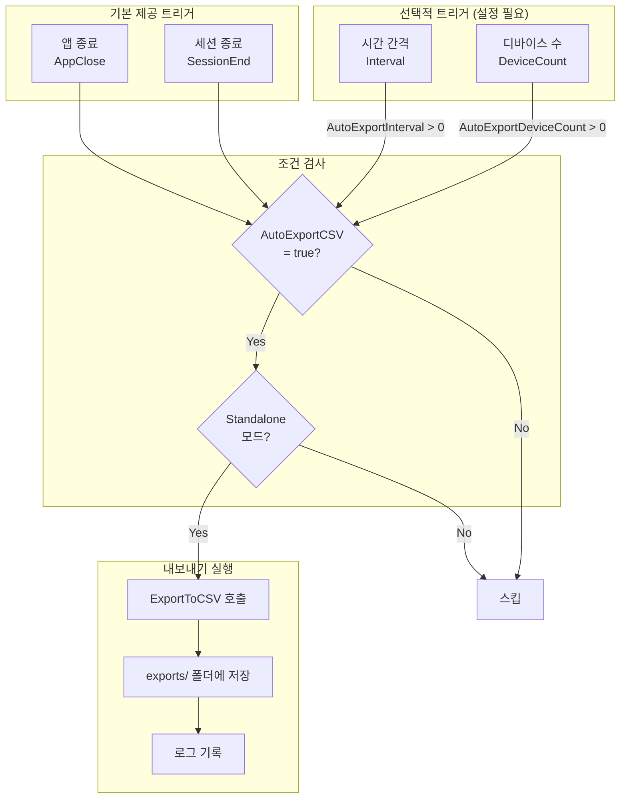

# Carrot QA V1 수정안 검토

## 수정 목표

**API 연동 2차 버전 준비를 위한 1단계 리팩토링**

현재 하드코딩된 외부 연동(MySQL DB, dtag API)을 **설정 기반 구조로 전환**하여:
1. 연동 기능의 활성화/비활성화를 설정으로 제어
2. 새로운 API 연동 구조 도입 준비
3. 기존 기능 유지하면서 점진적 마이그레이션 지원

---

## 수정 방향

### 현재 → V1 → V2 로드맵



### 핵심 변경 사항

| 항목 | 현재 | V1 수정 후 |
|------|------|-----------|
| DB 연결 | 하드코딩 | config.ini 설정 |
| API 엔드포인트 | 하드코딩 | config.ini 설정 |
| 기능 활성화 | 항상 ON | 설정으로 ON/OFF |
| 서버 전환 | 코드 수정 필요 | 설정만 변경 |

---

## 현재 시스템 분석

### 하드코딩된 연동 정보

| 위치 | 내용 | 라인 |
|------|------|------|
| `Taginfo.cs` | Main Server URL | 45 |
| `Taginfo.cs` | Main Server Bearer Token | 46 |
| `Taginfo.cs` | Main Server Host | 48 |
| `Taginfo.cs` | Test Server URL (주석) | 40 |
| `Taginfo.cs` | Test Server Bearer Token (주석) | 41 |
| `Taginfo.cs` | DB Connection String | 66 |

**현재 하드코딩 코드**:
```csharp
// Taginfo.cs 라인 44-48
string serverUrl = "https://dtag.carrotins.com:8080/api/v1/dtag/registries";
string serverBearer = "Bearer VSIDAZ6011517193EJUCUG";
string serverHost = "dtag.carrotins.com";

// Taginfo.cs 라인 66
ConnUrl = "Server=115.68.195.106;Database=carrotpluglist;Uid=luxrobo;Pwd=fjrtmfhqh123$;";
```

---

## 설정 구조 설계

### config.ini 확장 구조

```ini
[Application]
EnableLogging=false
; V1 신규: 동작 모드 설정 (기본값: standalone)
OperationMode=standalone          ; standalone | luckyboxSolution | carrotAPI
; V1 신규: 시뮬레이션 모드 (BLE 하드웨어 없이 테스트)
SimulationMode=false              ; true | false (기본값: false)

[DB]
; 기존 설정 (luckyboxSolution only)
Server=115.68.195.106
Port=3306
Database=carrotpluglist
User=luxrobo
Password=fjrtmfhqh123$
; V1 신규: DB 연동 활성화
EnableDB=true                 ; true | false
ConnectionTimeout=30          ; 초 단위

[API]
; V1 신규: API 설정 분리
EnableAPI=true                ; true | false
ServerType=main               ; main | test
; Main Server
MainServerUrl=https://dtag.carrotins.com:8080/api/v1/dtag/registries
MainServerHost=dtag.carrotins.com
MainServerBearer=Bearer VSIDAZ6011517193EJUCUG
; Test Server
TestServerUrl=https://t-dtag.carrotins.com:8080/api/v1/dtag/registries
TestServerHost=t-dtag.carrotins.com
TestServerBearer=Bearer KXKQNQ64380880304TLRQQ

[Network]
; 기존 설정
VPNEnable=true
VPNServer=
; V1 신규: VPN 검증 우회 옵션
BypassVPNCheck=false          ; true | false (개발/테스트용)

[LocalStorage]
; V1 신규: standalone 모드용 로컬 저장
EnableLocalCache=false        ; true | false
CacheDirectory=./cache
AutoExportCSV=false           ; true | false
```

---

## 파일별 수정 상세

### 1. Config.cs - 설정 관리 확장

#### 1.1 ApplicationSettings 클래스 확장

**현재 속성 (유지)**:
```csharp
public string DatabaseServer { get; set; }
public int DatabasePort { get; set; }
public string DatabaseName { get; set; }
public string DatabaseUser { get; set; }
public string DatabasePassword { get; set; }
public bool VPNEnable { get; set; }
public string VPNServer { get; set; }
```

**V1 추가 속성**:
```csharp
// [Application] 섹션
public OperationMode OperationMode { get; set; } = OperationMode.standalone;  // 기본값: standalone

// [DB] 섹션
public bool EnableDB { get; set; } = true;
public int ConnectionTimeout { get; set; } = 30;

// [API] 섹션
public bool EnableAPI { get; set; } = true;
public string ServerType { get; set; } = "main";      // main | test
public string MainServerUrl { get; set; }
public string MainServerHost { get; set; }
public string MainServerBearer { get; set; }
public string TestServerUrl { get; set; }
public string TestServerHost { get; set; }
public string TestServerBearer { get; set; }

// [Network] 섹션
public bool BypassVPNCheck { get; set; } = false;

// [LocalStorage] 섹션
public bool EnableLocalCache { get; set; } = false;
public string CacheDirectory { get; set; } = "./cache";
public bool AutoExportCSV { get; set; } = false;

// 헬퍼 프로퍼티
public string ActiveServerUrl => ServerType == "main" ? MainServerUrl : TestServerUrl;
public string ActiveServerHost => ServerType == "main" ? MainServerHost : TestServerHost;
public string ActiveServerBearer => ServerType == "main" ? MainServerBearer : TestServerBearer;
public bool IsOnlineMode => OperationMode == OperationMode.luckyboxSolution || OperationMode == OperationMode.carrotAPI;
public bool IsStandaloneMode => OperationMode == OperationMode.standalone;
public bool IsCarrotMode => OperationMode == OperationMode.carrotAPI;
```

#### 1.2 INI 로드 로직 확장

```csharp
// Config.cs 내 LoadSettings() 메서드 수정
private void LoadSettings()
{
    var ini = new IniFile("config.ini");

    // [Application]
    string modeStr = ini.GetValue("Application", "OperationMode", "standalone");
    OperationMode = Enum.TryParse<OperationMode>(modeStr, true, out var mode)
        ? mode
        : OperationMode.standalone;

    // [DB] - 기존 + 신규
    DatabaseServer = ini.GetValue("DB", "Server", "115.68.195.106");
    // ... 기존 설정 ...
    EnableDB = ini.GetBool("DB", "EnableDB", true);
    ConnectionTimeout = ini.GetInt("DB", "ConnectionTimeout", 30);

    // [API] - 신규 섹션
    EnableAPI = ini.GetBool("API", "EnableAPI", true);
    ServerType = ini.GetValue("API", "ServerType", "main");
    MainServerUrl = ini.GetValue("API", "MainServerUrl",
        "https://dtag.carrotins.com:8080/api/v1/dtag/registries");
    MainServerHost = ini.GetValue("API", "MainServerHost", "dtag.carrotins.com");
    MainServerBearer = ini.GetValue("API", "MainServerBearer",
        "Bearer VSIDAZ6011517193EJUCUG");
    // ... Test Server 설정 ...

    // [Network]
    BypassVPNCheck = ini.GetBool("Network", "BypassVPNCheck", false);

    // [LocalStorage]
    EnableLocalCache = ini.GetBool("LocalStorage", "EnableLocalCache", false);
    CacheDirectory = ini.GetValue("LocalStorage", "CacheDirectory", "./cache");
    AutoExportCSV = ini.GetBool("LocalStorage", "AutoExportCSV", false);
}
```

---

### 2. Taginfo.cs - Mydb 클래스 수정

#### 2.1 하드코딩된 값 → 설정 참조로 변경

**현재 코드 (라인 39-48)**:
```csharp
// 하드코딩된 서버 정보
string serverUrl = "https://dtag.carrotins.com:8080/api/v1/dtag/registries";
string serverBearer = "Bearer VSIDAZ6011517193EJUCUG";
string serverHost = "dtag.carrotins.com";
```

**V1 수정 후**:
```csharp
private readonly ApplicationSettings settings;
private string serverUrl;
private string serverBearer;
private string serverHost;

public Mydb(string url)
{
    settings = ApplicationSettings.Instance();

    // 설정에서 API 정보 로드
    serverUrl = settings.ActiveServerUrl;
    serverBearer = settings.ActiveServerBearer;
    serverHost = settings.ActiveServerHost;

    // DB 연결 (기존 로직 유지)
    if (settings.EnableDB)
    {
        ConnUrl = url;
        conn = new MySqlConnection(ConnUrl);
        // ...
    }
}
```

#### 2.2 API 호출 조건부 실행

**현재 코드 (regist_server 메서드)**:
```csharp
public int regist_server(string imei)
{
    // 항상 API 호출 시도
    ret = registries_server(serverUrl, serverHost, serverBearer);
    // ...
}
```

**V1 수정 후**:
```csharp
public int regist_server(string imei)
{
    // API 비활성화 시 스킵
    if (!settings.EnableAPI)
    {
        Trace.WriteLine($"API disabled - skipping registration for {imei}");
        return 0;  // 성공으로 처리 (또는 특정 코드)
    }

    // 기존 로직 유지
    ret = registries_server(serverUrl, serverHost, serverBearer);
    // ...
}
```

#### 2.3 DB 쿼리 조건부 실행

**쿼리 메서드들에 가드 추가**:
```csharp
public int UpdateQuery_qa2(string imei, string icc_id, string qa2,
                           string ng2_type, string ble_id, Taginfo taginfo)
{
    if (!settings.EnableDB || conn == null || conn.State != ConnectionState.Open)
    {
        Trace.WriteLine($"DB not available - qa2 update skipped for {imei}");
        return 0;
    }

    // 기존 로직 유지
    // ...
}
```

---

### 3. Form1.cs - 메인 폼 수정

#### 3.1 생성자 수정

**현재 코드**:
```csharp
public Form1()
{
    this.appSettings = ApplicationSettings.Instance();
    InitializeComponent();
    string connURL = this.MydbConnURL();
    this.mydb = new Mydb(connURL);
    this.Text = $"Carrot QA - BG770 v{VersionManager.Version}";
    DbConnetUpdate(this.mydb != null ? true : false);
}
```

**V1 수정 후**:
```csharp
public Form1()
{
    this.appSettings = ApplicationSettings.Instance();
    InitializeComponent();

    // 동작 모드에 따른 초기화
    if (appSettings.IsOnlineMode && appSettings.EnableDB)
    {
        string connURL = this.MydbConnURL();
        this.mydb = new Mydb(connURL);
    }

    // 타이틀에 모드 표시
    string modeText = appSettings.OperationMode.ToUpper();
    this.Text = $"Carrot QA - BG770 [{modeText}] v{VersionManager.Version}";

    DbConnetUpdate(this.mydb != null);
}
```

#### 3.2 DbTimeUp() 수정 - VPN 검증 조건부

**현재 코드 (라인 618-627)**:
```csharp
if (!ExternalVPNIsValid(ip))
{
    this.dbTimer.Stop();
    if (MessageBox.Show("IP 주소가 다릅니다...") != DialogResult.Yes)
    {
        Application.Exit();
    }
    this.dbTimer.Start();
}
```

**V1 수정 후**:
```csharp
// VPN 검증 우회 옵션 추가
if (!appSettings.BypassVPNCheck && !ExternalVPNIsValid(ip))
{
    this.dbTimer.Stop();
    if (MessageBox.Show("IP 주소가 다릅니다...") != DialogResult.Yes)
    {
        Application.Exit();
    }
    this.dbTimer.Start();
}
```

#### 3.3 DB 업데이트 조건부 실행

**현재 코드 (라인 636-649)**:
```csharp
if (tag.passFlagUpdate)
{
    if (modeFlag == 0)
        result = mydb.UpdateQuery_qa2(...);
    else
        result = mydb.UpdateQuery_qa3(...);
    // ...
}
```

**V1 수정 후**:
```csharp
if (tag.passFlagUpdate)
{
    if (appSettings.EnableDB && mydb != null)
    {
        if (modeFlag == 0)
            result = mydb.UpdateQuery_qa2(...);
        else
            result = mydb.UpdateQuery_qa3(...);

        tag.dbString = (result == 1) ? "OK" : "Fail";
    }
    else
    {
        // Standalone 모드: DB 없이 처리
        tag.dbString = "Local";
        result = 1;  // 성공으로 처리

        // 로컬 캐시 저장 (옵션)
        if (appSettings.EnableLocalCache)
        {
            SaveToLocalCache(tag);
        }
    }
    tag.passFlagUpdate = false;
}
```

#### 3.4 UI 상태 표시 개선

**DbConnetUpdate() 수정**:
```csharp
private void DbConnetUpdate(bool connected)
{
    System.Drawing.Color foreColor, backColor;
    string displayText;

    if (appSettings.IsStandaloneMode)
    {
        foreColor = System.Drawing.Color.Blue;
        backColor = System.Drawing.Color.LightBlue;
        displayText = "STANDALONE";
    }
    else if (connected)
    {
        foreColor = System.Drawing.Color.Green;
        backColor = System.Drawing.Color.LightGreen;
        displayText = appSettings.DatabaseServer;
        // 텍스트 길이 제한
        if (displayText.Length > 28)
            displayText = displayText.Substring(0, 25) + "...";
    }
    else
    {
        foreColor = System.Drawing.Color.Red;
        backColor = System.Drawing.Color.LightPink;
        displayText = "DISCONNECTED";
    }

    db_host.Text = displayText;
    db_host.ForeColor = foreColor;
    db_host.BackColor = backColor;
}
```

---

### 4. Form2.cs - 제품 조회 폼

#### 4.1 설정 기반 DB 연결

**V1 수정 후**:
```csharp
public Form2(string version)
{
    this.appSettings = ApplicationSettings.Instance();
    InitializeComponent();

    if (appSettings.EnableDB)
    {
        ConnUrl = this.MydbConnURL();
        this.conn = new MySqlConnection(ConnUrl);
        if (this.conn.State == ConnectionState.Closed)
        {
            this.conn.Open();
        }
    }
    else
    {
        // DB 비활성화 시 알림
        MessageBox.Show("DB 연결이 비활성화되어 있습니다.\n설정에서 EnableDB를 확인하세요.",
                       "알림", MessageBoxButtons.OK, MessageBoxIcon.Information);
    }
}

private void SearchImei(string imeiStr)
{
    if (!appSettings.EnableDB || conn == null || conn.State != ConnectionState.Open)
    {
        MessageBox.Show("DB 연결을 사용할 수 없습니다.", "오류");
        return;
    }

    // 기존 검색 로직 유지
    // ...
}
```

---

## 동작 모드 정의

### OperationMode 열거형

```csharp
/// <summary>
/// 애플리케이션 동작 모드 정의
/// </summary>
public enum OperationMode
{
    /// <summary>
    /// 독립 실행 모드 - DB/API 연동 없이 로컬에서만 동작 (기본값)
    /// </summary>
    standalone,

    /// <summary>
    /// 럭키박스 솔루션 연동 모드 - 기존 DB/API 연동
    /// </summary>
    luckyboxSolution,

    /// <summary>
    /// 캐롯 API 연동 모드 - V2 API 준비
    /// </summary>
    carrotAPI
}
```

### 모드별 동작

| 모드 | 설명 | DB 연결 | API 호출 | VPN 검증 | 로컬 캐시 |
|------|------|---------|----------|----------|----------|
| `standalone` (기본값) | 독립 실행 모드 | ❌ | ❌ | ❌ | ✅ |
| `luckyboxSolution` | 럭키박스 솔루션 연동 | ✅ | ✅ | ✅ | ❌ |
| `carrotAPI` | 캐롯 연동 (V2 준비) | ✅ | ✅ | ⚙️ 설정 | ✅ |

### 모드 전환 시나리오



---

## 로컬 캐시 기능 (Standalone 모드)

### 데이터 저장 형식

Standalone 모드에서는 외부 DB/API 없이 로컬에 데이터를 저장합니다.

#### 저장 디렉토리 구조

```
{CacheDirectory}/
├── devices/                      # 디바이스별 JSON 파일
│   ├── 863593012345678.json
│   ├── 863593012345679.json
│   └── ...
├── sessions/                     # 세션별 결과
│   ├── 20240318_143022.json      # 세션 시작 시간
│   └── ...
├── exports/                      # CSV 내보내기
│   ├── QA_Result_20240318.csv
│   └── ...
└── index.json                    # 인덱스 파일
```

#### JSON 데이터 형식

**디바이스 파일 (devices/{imei}.json)**:
```json
{
    "imei": "863593012345678",
    "iccId": "8982050123456789012",
    "bleId": "4C520000-E25D-11EB-BA80-001122334455",
    "mac": "001122334455",
    "version": "v1.2.3",
    "versionNumber": 16843009,
    "rssi": -65,
    "qaResult": {
        "qa1": "OK",
        "qa2": "OK",
        "qa3": "NG",
        "ng1Type": "",
        "ng2Type": "",
        "ng3Type": "v1.2.3 Version Mismatch"
    },
    "sensorData": {
        "gpsSnr": 35,
        "temperature": 25,
        "capacitance": 120,
        "bleRssi": -65,
        "lteB3": {
            "min": -85,
            "avg": -80,
            "max": -75
        },
        "lteB5": {
            "min": -90,
            "avg": -85,
            "max": -80
        }
    },
    "goldReference": {
        "gps": 30,
        "gpsMargin": 5,
        "temp": 25,
        "tempMargin": 10,
        "capMin": 100,
        "capMax": 150,
        "b3": -80,
        "b3Margin": -10,
        "b5": -85,
        "b5Margin": -10
    },
    "timestamp": {
        "firstSeen": "2024-03-18T14:30:22.123Z",
        "lastUpdate": "2024-03-18T14:35:45.456Z"
    },
    "syncStatus": {
        "synced": false,
        "syncAttempts": 0,
        "lastSyncError": null
    }
}
```

**세션 파일 (sessions/{datetime}.json)**:
```json
{
    "sessionId": "20240318_143022",
    "startTime": "2024-03-18T14:30:22.000Z",
    "endTime": "2024-03-18T16:45:30.000Z",
    "operationMode": "standalone",
    "statistics": {
        "totalScanned": 150,
        "passed": 142,
        "failed": 8,
        "passRate": 94.67
    },
    "devices": [
        "863593012345678",
        "863593012345679"
    ],
    "failedDevices": [
        {
            "imei": "863593012345680",
            "failureType": "GPS Fail",
            "timestamp": "2024-03-18T15:22:10.000Z"
        }
    ]
}
```

**인덱스 파일 (index.json)**:
```json
{
    "version": "1.0",
    "lastUpdated": "2024-03-18T16:45:30.000Z",
    "totalDevices": 150,
    "sessions": [
        {
            "sessionId": "20240318_143022",
            "deviceCount": 75,
            "passCount": 72
        },
        {
            "sessionId": "20240318_100512",
            "deviceCount": 75,
            "passCount": 70
        }
    ],
    "pendingSync": 8
}
```

#### CSV 내보내기 형식

**QA_Result_{날짜}.csv**:
```csv
IMEI,ICC_ID,BLE_ID,VERSION,QA1,QA2,QA3,NG_TYPE,GPS_SNR,TEMP,CAP,BLE_RSSI,LTE_B3_AVG,LTE_B5_AVG,TIMESTAMP
863593012345678,8982050123456789012,4C520000-E25D-11EB-BA80-001122334455,v1.2.3,OK,OK,OK,,35,25,120,-65,-80,-85,2024-03-18T14:35:45
863593012345679,8982050123456789013,4C520000-E25D-11EB-BA80-001122334456,v1.2.3,OK,OK,NG,Version Mismatch,32,24,115,-68,-82,-87,2024-03-18T14:40:12
```

### AutoExportCSV 자동 트리거 시점

#### AutoExportType 열거형

```csharp
/// <summary>
/// 자동 CSV 내보내기 트리거 타입 정의
/// </summary>
[Flags]
public enum AutoExportType
{
    /// <summary>
    /// 비활성화
    /// </summary>
    None = 0,

    /// <summary>
    /// 세션 종료 시 (Clear 버튼) - 기본 제공
    /// </summary>
    SessionEnd = 1,

    /// <summary>
    /// 애플리케이션 종료 시 - 기본 제공
    /// </summary>
    AppClose = 2,

    /// <summary>
    /// 일정 시간 간격 (설정 필요)
    /// </summary>
    Interval = 4,

    /// <summary>
    /// 일정 디바이스 수 도달 시 (설정 필요)
    /// </summary>
    DeviceCount = 8
}
```

#### 트리거 유형별 동작

Standalone 모드에서 `AutoExportCSV=true` 설정 시, 다음 시점에 자동으로 CSV 내보내기가 실행됩니다:

| 트리거 시점 | 설명 | 타입 | 설정 필요 |
|------------|------|------|----------|
| **세션 종료** | "Clear" 버튼 클릭 시 세션 종료와 함께 실행 | 기본 제공 | ❌ |
| **애플리케이션 종료** | `Form1_FormClosing` 이벤트에서 실행 | 기본 제공 | ❌ |
| **일정 간격** | 설정된 간격(기본 30분)마다 자동 백업 | 선택 | ✅ |
| **일정 수량 도달** | N개 디바이스 스캔 완료 시 (기본: 50개) | 선택 | ✅ |

> **참고**: `SessionEnd`와 `AppClose`는 `AutoExportCSV=true`일 때 **설정 없이 기본으로 제공**됩니다.
> `Interval`과 `DeviceCount`는 추가 설정이 필요한 선택적 트리거입니다.

#### 설정 항목 (config.ini)

```ini
[LocalStorage]
EnableLocalCache=true
CacheDirectory=./cache
AutoExportCSV=true              ; 자동 내보내기 활성화 (SessionEnd, AppClose 기본 포함)
; 선택적 트리거 설정
AutoExportInterval=30           ; 분 단위 (0 = 비활성화, Interval 트리거)
AutoExportDeviceCount=50        ; 디바이스 수 기준 (0 = 비활성화, DeviceCount 트리거)
```

#### 구현 로직

```csharp
// Form1.cs에 추가
private Timer autoExportTimer;
private int deviceCountSinceLastExport = 0;

private void InitializeAutoExport()
{
    if (!appSettings.AutoExportCSV || !appSettings.IsStandaloneMode)
        return;

    // 선택적: 시간 기반 자동 내보내기 (Interval 트리거)
    if (appSettings.AutoExportInterval > 0)
    {
        autoExportTimer = new Timer();
        autoExportTimer.Interval = appSettings.AutoExportInterval * 60 * 1000; // 분 → 밀리초
        autoExportTimer.Tick += (s, e) => PerformAutoExport(AutoExportType.Interval);
        autoExportTimer.Start();
    }
}

private void OnDeviceScanned(Taginfo tag)
{
    // 기존 처리 로직...
    localCache.SaveTag(tag);

    // 선택적: 디바이스 수 기반 자동 내보내기 (DeviceCount 트리거)
    if (appSettings.AutoExportDeviceCount > 0)
    {
        deviceCountSinceLastExport++;
        if (deviceCountSinceLastExport >= appSettings.AutoExportDeviceCount)
        {
            PerformAutoExport(AutoExportType.DeviceCount);
            deviceCountSinceLastExport = 0;
        }
    }
}

private void ClearButton_Click(object sender, EventArgs e)
{
    // BLE 스캔 중지 (세션 종료)
    StopBleScanning();

    // 기본 제공: 세션 종료 시 자동 내보내기 (SessionEnd 트리거)
    if (appSettings.AutoExportCSV)
    {
        PerformAutoExport(AutoExportType.SessionEnd);
    }

    // 기존 Clear 로직...
}

private void Form1_FormClosing(object sender, FormClosingEventArgs e)
{
    // 기본 제공: 앱 종료 시 자동 내보내기 (AppClose 트리거)
    if (appSettings.AutoExportCSV)
    {
        PerformAutoExport(AutoExportType.AppClose);
    }

    // 기존 종료 로직...
}

private void PerformAutoExport(AutoExportType trigger)
{
    try
    {
        string filepath = localCache.ExportToCSV();
        Trace.WriteLine($"AutoExport [{trigger}]: {filepath}");

        // 선택: 사용자 알림 (기본 트리거에서만)
        if (trigger == AutoExportType.AppClose || trigger == AutoExportType.SessionEnd)
        {
            // 종료/세션 종료 시에만 알림 (방해 최소화)
            // MessageBox는 선택적
        }
    }
    catch (Exception ex)
    {
        Trace.WriteLine($"AutoExport failed [{trigger}]: {ex.Message}");
    }
}
```

#### 자동 내보내기 흐름도



### LocalCache 클래스 설계

```csharp
public class LocalCache
{
    private readonly string cacheDir;
    private readonly ApplicationSettings settings;
    private readonly string devicesDir;
    private readonly string sessionsDir;
    private readonly string exportsDir;

    public LocalCache()
    {
        settings = ApplicationSettings.Instance();
        cacheDir = settings.CacheDirectory;
        devicesDir = Path.Combine(cacheDir, "devices");
        sessionsDir = Path.Combine(cacheDir, "sessions");
        exportsDir = Path.Combine(cacheDir, "exports");

        // 디렉토리 생성
        Directory.CreateDirectory(devicesDir);
        Directory.CreateDirectory(sessionsDir);
        Directory.CreateDirectory(exportsDir);
    }

    /// <summary>
    /// 태그 정보를 로컬 캐시에 저장
    /// </summary>
    public void SaveTag(Taginfo tag)
    {
        if (!settings.EnableLocalCache) return;

        var deviceData = new DeviceData
        {
            Imei = tag.TagIMEI,
            IccId = tag.TagIccID,
            BleId = tag.TagBleID,
            Mac = tag.TagMac,
            Version = tag.TagVersion,
            VersionNumber = tag.TagVersionNumber,
            Rssi = tag.TagRssi,
            QaResult = new QaResultData
            {
                Qa1 = tag.qa1,
                Qa2 = tag.qa2,
                Qa3 = tag.qa3,
                Ng1Type = tag.ng1Type,
                Ng2Type = tag.ng2Type,
                Ng3Type = tag.ng3Type
            },
            SensorData = new SensorDataBlock
            {
                GpsSnr = tag.ng2_gpsSnr,
                Temperature = tag.ng2_temp,
                Capacitance = tag.ng2_cap,
                BleRssi = tag.ng2_ble_rssi,
                LteB3 = new LteBandData
                {
                    Min = tag.ng2_b3_min,
                    Avg = tag.ng2_b3_avg,
                    Max = tag.ng2_b3_max
                },
                LteB5 = new LteBandData
                {
                    Min = tag.ng2_b5_min,
                    Avg = tag.ng2_b5_avg,
                    Max = tag.ng2_b5_max
                }
            },
            Timestamp = new TimestampData
            {
                LastUpdate = DateTime.UtcNow
            },
            SyncStatus = new SyncStatusData
            {
                Synced = false
            }
        };

        string filename = Path.Combine(devicesDir, $"{tag.TagIMEI}.json");
        string json = JsonConvert.SerializeObject(deviceData, Formatting.Indented);
        File.WriteAllText(filename, json);

        UpdateIndex();
    }

    /// <summary>
    /// 캐시에서 태그 정보 로드
    /// </summary>
    public Taginfo LoadTag(string imei)
    {
        string filename = Path.Combine(devicesDir, $"{imei}.json");
        if (!File.Exists(filename)) return null;

        string json = File.ReadAllText(filename);
        var deviceData = JsonConvert.DeserializeObject<DeviceData>(json);

        return ConvertToTaginfo(deviceData);
    }

    /// <summary>
    /// 모든 캐시 데이터를 CSV로 내보내기
    /// </summary>
    public string ExportToCSV()
    {
        string filename = $"QA_Result_{DateTime.Now:yyyyMMdd_HHmmss}.csv";
        string filepath = Path.Combine(exportsDir, filename);

        var sb = new StringBuilder();
        sb.AppendLine("IMEI,ICC_ID,BLE_ID,VERSION,QA1,QA2,QA3,NG_TYPE,GPS_SNR,TEMP,CAP,BLE_RSSI,LTE_B3_AVG,LTE_B5_AVG,TIMESTAMP");

        foreach (var file in Directory.GetFiles(devicesDir, "*.json"))
        {
            var json = File.ReadAllText(file);
            var device = JsonConvert.DeserializeObject<DeviceData>(json);

            string ngType = string.Join("|", new[] { device.QaResult.Ng1Type, device.QaResult.Ng2Type, device.QaResult.Ng3Type }
                .Where(s => !string.IsNullOrEmpty(s)));

            sb.AppendLine($"{device.Imei},{device.IccId},{device.BleId},{device.Version}," +
                         $"{device.QaResult.Qa1},{device.QaResult.Qa2},{device.QaResult.Qa3},{ngType}," +
                         $"{device.SensorData.GpsSnr},{device.SensorData.Temperature},{device.SensorData.Capacitance}," +
                         $"{device.SensorData.BleRssi},{device.SensorData.LteB3.Avg},{device.SensorData.LteB5.Avg}," +
                         $"{device.Timestamp.LastUpdate:s}");
        }

        File.WriteAllText(filepath, sb.ToString(), Encoding.UTF8);
        return filepath;
    }

    /// <summary>
    /// 세션 정보 저장
    /// </summary>
    public void SaveSession(SessionData session)
    {
        string filename = Path.Combine(sessionsDir, $"{session.SessionId}.json");
        string json = JsonConvert.SerializeObject(session, Formatting.Indented);
        File.WriteAllText(filename, json);
    }

    /// <summary>
    /// 온라인 복구 시 캐시 데이터를 DB에 동기화
    /// </summary>
    public async Task<int> SyncToDatabase(Mydb db)
    {
        int syncedCount = 0;
        var files = Directory.GetFiles(devicesDir, "*.json");

        foreach (var file in files)
        {
            var json = File.ReadAllText(file);
            var device = JsonConvert.DeserializeObject<DeviceData>(json);

            if (!device.SyncStatus.Synced)
            {
                try
                {
                    var tag = ConvertToTaginfo(device);
                    int result = await Task.Run(() =>
                        db.UpdateQuery_qa2(tag.TagIMEI, tag.TagIccID, tag.passFlag,
                                          tag.TagFlagString, tag.TagBleID, tag));

                    if (result == 1)
                    {
                        device.SyncStatus.Synced = true;
                        device.SyncStatus.SyncedAt = DateTime.UtcNow;
                        File.WriteAllText(file, JsonConvert.SerializeObject(device, Formatting.Indented));
                        syncedCount++;
                    }
                }
                catch (Exception ex)
                {
                    device.SyncStatus.SyncAttempts++;
                    device.SyncStatus.LastSyncError = ex.Message;
                    File.WriteAllText(file, JsonConvert.SerializeObject(device, Formatting.Indented));
                }
            }
        }

        UpdateIndex();
        return syncedCount;
    }

    private void UpdateIndex()
    {
        // 인덱스 파일 업데이트 로직
    }

    private Taginfo ConvertToTaginfo(DeviceData device)
    {
        // DeviceData → Taginfo 변환 로직
    }
}
```

### 데이터 모델 클래스

```csharp
public class DeviceData
{
    public string Imei { get; set; }
    public string IccId { get; set; }
    public string BleId { get; set; }
    public string Mac { get; set; }
    public string Version { get; set; }
    public uint VersionNumber { get; set; }
    public int Rssi { get; set; }
    public QaResultData QaResult { get; set; }
    public SensorDataBlock SensorData { get; set; }
    public GoldReferenceData GoldReference { get; set; }
    public TimestampData Timestamp { get; set; }
    public SyncStatusData SyncStatus { get; set; }
}

public class QaResultData
{
    public string Qa1 { get; set; }
    public string Qa2 { get; set; }
    public string Qa3 { get; set; }
    public string Ng1Type { get; set; }
    public string Ng2Type { get; set; }
    public string Ng3Type { get; set; }
}

public class SensorDataBlock
{
    public int GpsSnr { get; set; }
    public int Temperature { get; set; }
    public int Capacitance { get; set; }
    public int BleRssi { get; set; }
    public LteBandData LteB3 { get; set; }
    public LteBandData LteB5 { get; set; }
}

public class LteBandData
{
    public int Min { get; set; }
    public int Avg { get; set; }
    public int Max { get; set; }
}

public class GoldReferenceData
{
    public int Gps { get; set; }
    public int GpsMargin { get; set; }
    public int Temp { get; set; }
    public int TempMargin { get; set; }
    public int CapMin { get; set; }
    public int CapMax { get; set; }
    public int B3 { get; set; }
    public int B3Margin { get; set; }
    public int B5 { get; set; }
    public int B5Margin { get; set; }
}

public class TimestampData
{
    public DateTime FirstSeen { get; set; }
    public DateTime LastUpdate { get; set; }
}

public class SyncStatusData
{
    public bool Synced { get; set; }
    public DateTime? SyncedAt { get; set; }
    public int SyncAttempts { get; set; }
    public string LastSyncError { get; set; }
}

public class SessionData
{
    public string SessionId { get; set; }
    public DateTime StartTime { get; set; }
    public DateTime? EndTime { get; set; }
    public string OperationMode { get; set; }
    public SessionStatistics Statistics { get; set; }
    public List<string> Devices { get; set; }
    public List<FailedDeviceInfo> FailedDevices { get; set; }
}

public class SessionStatistics
{
    public int TotalScanned { get; set; }
    public int Passed { get; set; }
    public int Failed { get; set; }
    public double PassRate => TotalScanned > 0 ? (double)Passed / TotalScanned * 100 : 0;
}

public class FailedDeviceInfo
{
    public string Imei { get; set; }
    public string FailureType { get; set; }
    public DateTime Timestamp { get; set; }
}
```

---

## 수정 작업 체크리스트

### Phase 1: 설정 구조 확장 ✅

- [x] `Config.cs`에 새 설정 속성 추가
- [x] `config.ini` 기본 템플릿 업데이트
- [x] INI 파일 로드/저장 로직 확장
- [x] 헬퍼 프로퍼티 구현 (`ActiveServerUrl`, `IsOnlineMode` 등)
- [x] `SimulationMode` 설정 추가

### Phase 2: Mydb 클래스 리팩토링 ✅

- [x] 하드코딩된 API 정보 → 설정 참조로 변경
- [x] DB 연결 조건부 실행 가드 추가
- [x] API 호출 조건부 실행 가드 추가
- [x] 연결 실패 시 graceful 처리
- [x] `IsConnected` 프로퍼티 추가

### Phase 3: Form1 수정 ✅

- [x] 생성자에서 모드별 초기화 분기
- [x] VPN 검증 우회 옵션 적용
- [x] DB 업데이트 조건부 실행
- [x] UI 상태 표시 개선 (모드 표시)
- [x] Simulation 모드 통합

### Phase 4: Form2 수정 ✅

- [x] DB 연결 조건부 실행
- [x] Standalone 모드 시 사용자 알림

### Phase 5: 로컬 캐시 구현 ✅

- [x] `LocalCache` 클래스 구현
- [x] JSON 저장/로드 기능
- [x] CSV 내보내기 기능
- [x] 인덱스 파일 업데이트 기능

### Phase 6: Simulation 모드 구현 ✅

- [x] `SimulationEngine` 클래스 구현
- [x] 랜덤 태그 생성 (80% PASS 비율)
- [x] Form1 통합 (BtnStartBle, DbTimeUp, BtnClearBle, BtnMode)
- [x] LocalCache와 통합
- [x] ListView 색상 처리 (SIM, Local 정상 표시)

### Phase 7: 테스트 및 검증

- [ ] 각 모드별 동작 테스트
- [ ] 모드 전환 시나리오 테스트
- [ ] 설정 변경 후 재시작 테스트
- [ ] Simulation 모드 테스트

---

## 예상 코드 변경량

| 파일 | 현재 라인 | 추가 | 수정 | 제거 |
|------|----------|------|------|------|
| `Config.cs` | ~650 | ~100 | ~30 | 0 |
| `Taginfo.cs` | ~650 | ~20 | ~50 | 0 |
| `Form1.cs` | ~1320 | ~50 | ~80 | 0 |
| `Form2.cs` | ~151 | ~20 | ~15 | 0 |
| `LocalCache.cs` | 0 | ~150 | 0 | 0 |
| **합계** | ~2771 | ~340 | ~175 | 0 |

---

## 마이그레이션 가이드

### 기존 환경에서 V1으로 업그레이드

1. **설정 파일 백업**
   ```bash
   copy config.ini config.ini.backup
   ```

2. **새 config.ini 생성** (또는 기존 파일에 추가)
   ```ini
   ; 기존 설정 유지
   [DB]
   Server=115.68.195.106
   ; ... 기존 설정 ...
   EnableDB=true              ; 추가

   ; 신규 섹션 추가
   [API]
   EnableAPI=true
   ServerType=main
   ; ... API 설정 ...
   ```

3. **애플리케이션 재시작**

4. **동작 확인**
   - 타이틀에 `[LUCKYBOXSOLUTION]` 표시 확인
   - DB 연결 상태 표시 확인
   - QA 테스트 정상 동작 확인

### Standalone 모드 전환

```ini
[Application]
OperationMode=standalone

[DB]
EnableDB=false

[API]
EnableAPI=false

[LocalStorage]
EnableLocalCache=true
CacheDirectory=./cache
AutoExportCSV=true
```

### Carrot 모드 (V2 준비)

```ini
[Application]
OperationMode=CarrotAPI

[DB]
EnableDB=true

[API]
EnableAPI=true
ServerType=main
; V2 API 설정 추가 예정

[LocalStorage]
EnableLocalCache=true
CacheDirectory=./cache
AutoExportCSV=false
```

---

## V2 연동을 위한 확장 포인트

### API 인터페이스 추상화 (V2 준비)

```csharp
// V2에서 도입할 인터페이스
public interface IDeviceRegistrationService
{
    Task<RegistrationResult> RegisterDevice(DeviceInfo device);
    Task<DeviceInfo> GetDevice(string imei);
    Task<bool> UpdateQAStatus(string imei, QAResult result);
}

// 현재 구현 (V1)
public class DtagRegistrationService : IDeviceRegistrationService
{
    // 기존 dtag API 로직
}

// V2에서 추가될 구현
public class NewApiRegistrationService : IDeviceRegistrationService
{
    // 새로운 API 로직
}
```

### 설정 기반 서비스 전환 (V2)

```ini
[API]
ServiceType=dtag            ; dtag | newapi | hybrid
; ... 서비스별 설정 ...
```

---

## Simulation 모드

### 개요

BLE 하드웨어 없이 애플리케이션의 기능을 테스트할 수 있는 시뮬레이션 모드입니다.

### 설정

```ini
[Application]
SimulationMode=false           ; true | false (기본값: false)
```

### SimulationEngine 클래스

```csharp
/// <summary>
/// BLE 하드웨어 없이 테스트 데이터를 생성하는 시뮬레이션 엔진
/// </summary>
internal class SimulationEngine
{
    private readonly Random random = new Random();
    private int sequence = 0;
    private const int MaxDevices = 40;

    /// <summary>
    /// 시뮬레이션 상태 초기화
    /// </summary>
    public void Reset() { sequence = 0; }

    /// <summary>
    /// 주기적으로 호출되어 랜덤 태그 데이터를 생성
    /// </summary>
    public void Tick(ObservableCollection<Taginfo> tagColl, Dictionary<string, Taginfo> tagList)
    {
        // 80% 확률로 PASS, 20% 확률로 FAIL
        // 최대 MaxDevices(40)개까지 디바이스 생성
    }
}
```

### 구현 세부사항

#### Form1.cs 통합

| 메서드 | 설명 |
|--------|------|
| `Form1()` | Simulation 모드일 때 타이틀에 "- Simulation" 표시 |
| `BtnStartBle_Click()` | Simulation 모드에서 `watchStarted` 플래그만 토글 (BLE watcher 미사용) |
| `BtnMode_Click()` | Simulation 모드에서 BLE watcher 이벤트 해제 방지 |
| `BtnClearBle_Click()` | `simulationEngine.Reset()` 및 `simulationSeenImei.Clear()` 호출 |
| `DbTimeUp()` | Simulation 모드에서 `simulationEngine.Tick()` 호출 및 LocalCache 저장 |

#### LocalCache 초기화 조건

```csharp
// Form1.cs 생성자
// Simulation 모드에서도 LocalCache가 초기화됨
if (appSettings.IsStandaloneMode || appSettings.IsCarrotMode || appSettings.SimulationMode)
{
    if (appSettings.EnableLocalCache)
    {
        this.localCache = new LocalCache();
    }
}
```

#### ListView 표시

| dbString 값 | 색상 | 설명 |
|-------------|------|------|
| `"OK"` | 기본 | DB 저장 성공 |
| `"SIM"` | 기본 | Simulation 모드 |
| `"Local"` | 기본 | Standalone 모드 (로컬 저장) |
| 그 외 | 빨간색 | 오류 상태 |

### Simulation 모드 흐름도

```mermaid
flowchart TB
    subgraph Init["초기화"]
        S1[Form1 생성자]
        S2{SimulationMode?}
        S3[타이틀에 '- Simulation' 추가]
        S4[LocalCache 초기화]
    end

    subgraph Start["스캔 시작"]
        B1[Start 버튼 클릭]
        B2{SimulationMode?}
        B3[watchStarted = true]
        B4[BLE watcher 시작]
    end

    subgraph Tick["주기적 실행 (DbTimeUp)"]
        T1{SimulationMode?}
        T2[simulationEngine.Tick 호출]
        T3[랜덤 태그 생성]
        T4[passCount 계산]
        T5[LocalCache 저장]
        T6[일반 BLE 처리]
    end

    subgraph Clear["Clear 버튼"]
        C1[Clear 버튼 클릭]
        C2[simulationEngine.Reset]
        C3[simulationSeenImei.Clear]
        C4[AutoExport 실행]
    end

    S1 --> S2
    S2 -->|Yes| S3
    S3 --> S4
    S2 -->|No| S4

    B1 --> B2
    B2 -->|Yes| B3
    B2 -->|No| B4

    T1 -->|Yes| T2
    T2 --> T3
    T3 --> T4
    T4 --> T5
    T1 -->|No| T6

    C1 --> C2
    C2 --> C3
    C3 --> C4
```



---

## 구현 완료 현황

### Phase 1: 설정 구조 확장 ✅

- [x] `Config.cs`에 `OperationMode` enum 추가
- [x] `Config.cs`에 `AutoExportType` enum 추가
- [x] `Config.cs`에 `SimulationMode` 설정 추가
- [x] `ApplicationSettings` 클래스 확장 (EnableDB, EnableAPI, LocalStorage 등)
- [x] 헬퍼 프로퍼티 구현 (`IsOnlineMode`, `IsStandaloneMode`, `IsCarrotMode`)

### Phase 2: Mydb 클래스 리팩토링 ✅

- [x] 하드코딩된 API 정보 → 설정 참조로 변경
- [x] `IsConnected` 프로퍼티 추가
- [x] DB 연결 조건부 실행 가드 추가
- [x] API 호출 조건부 실행 가드 추가

### Phase 3: Form1 수정 ✅

- [x] 생성자에서 모드별 초기화 분기
- [x] VPN 검증 우회 옵션 적용 (`BypassVPNCheck`)
- [x] DB 업데이트 조건부 실행
- [x] UI 상태 표시 개선 (모드 표시, Standalone 색상)
- [x] 자동 CSV 내보내기 구현 (SessionEnd, AppClose, Interval, DeviceCount)
- [x] Simulation 모드 통합

### Phase 4: Form2 수정 ✅

- [x] DB 연결 조건부 실행
- [x] Standalone 모드 시 사용자 알림

### Phase 5: 로컬 캐시 구현 ✅

- [x] `LocalCache` 클래스 구현
- [x] JSON 저장/로드 기능
- [x] CSV 내보내기 기능
- [x] 데이터 모델 클래스 (DeviceData, SessionData 등)

### Phase 6: Simulation 모드 구현 ✅

- [x] `SimulationEngine` 클래스 구현
- [x] 랜덤 태그 생성 (80% PASS 비율)
- [x] Form1 통합 (BtnStartBle, DbTimeUp, BtnClearBle, BtnMode)
- [x] LocalCache와 통합 (Simulation 모드에서 저장 가능)
- [x] ListView 색상 처리 (SIM, Local 정상 표시)

---

## 결론

### V1 수정 범위

1. **필수**: 설정 구조 확장 (Config.cs, config.ini) ✅
2. **필수**: 하드코딩 제거 및 설정 참조 (Taginfo.cs, Form1.cs) ✅
3. **필수**: 조건부 실행 가드 추가 ✅
4. **권장**: 로컬 캐시 기능 구현 ✅
5. **선택**: UI 개선 (모드 표시) ✅
6. **추가**: Simulation 모드 구현 ✅

### 예상 효과

| 항목 | Before | After V1 |
|------|--------|----------|
| 설정 변경 | 코드 수정 필요 | config.ini만 수정 |
| 서버 전환 | 재컴파일 필요 | 설정만 변경 |
| Standalone 사용 | 불가 | 가능 |
| V2 API 연동 준비 | ❌ | ✅ |
| 하드코딩 | 많음 | 최소화 |
| 테스트 용이성 | 낮음 | 높음 |
| BLE 없이 테스트 | 불가 | Simulation 모드로 가능 |

### V2 로드맵

```
V1 (현재 준비)        V2 (예정)
    │                    │
    ├─ 설정 구조 확장     ├─ API 인터페이스 추상화
    ├─ 하드코딩 제거      ├─ 새 API 서비스 구현
    ├─ 조건부 실행        ├─ DI 컨테이너 도입
    ├─ 로컬 캐시          └─ 서비스 전환 로직
    └─ Simulation 모드
```
